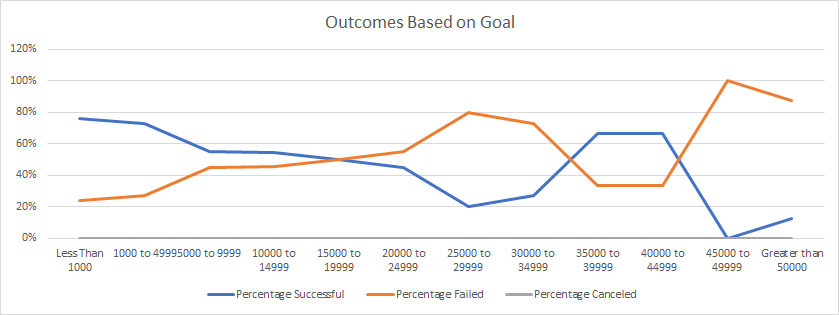

# Kickstarting with Excel

## Overview of Project

### Purpose 
The purpose of this analysis is to identify a general guidance on the goal amount that should be requested and the time of year to hold a kickstarter campaign for theater events and more specifically plays.  We are seeking to understand what an appropriate goal is and if there is such thing as asking for too much or too little funding.  We seek to understand the most optimal time of year to obtain these funds and if timing is a factor on when to hold a campaign.

## Analysis and Challenges

### Analysis of Outcomes Based on Launch Date
When conducting my analysis on Outcomes Based on Launch Date I looked at the two standout months of May and June.  Initially it appears that May is the most optimal time based on total successful projects but I went ahead and conducted a seperate calculation (not shown) that resulted in confirming this assumpton, however it is marginal.

### Analysis of Outcomes Based on Goals
In conducting my analysis it is evident that as the funding request increase the line of the chart also decreases.  It would may appear that success is also possible from 35,000 to 45,000, however the number of campaigns is signficantly less.  The chart itself was helpful but lacked the insight into the amount of projects which is why I also used the table to help provide more clarity.  

### Challenges and Difficulties Encountered
I did not encounter any significant difficulties.  It took me a minute to remeber how to complete the COUNTIFS formula and I needed to reference the hint to spark my memory.  
One challenge I had was combating my prior experience and formating preferences with Excel to comply with the course expectations.  I was unable to name the Theater Outcomes sheet exactly as requested by the challenge because it excel wouldn't allow it.  I did deal with a constant freeze scenario in which my frozen pane would affect my ability to scroll within a specific sheet.  I was able to resolve the issue by simply removing the frozen pane.

## Results

**- What are two conclusions you can draw about the Outcomes based on Launch Date?**
- June yeilds a 65% chance of a successful theater event and May yeilds a 67%. From a percantage standpoint, it would be advised to launch a kickstarter in the month of May.  However, both May and June have a >= 100 successful kickstarters.  Launching a kickstarter after May will result in lower and lower liklihood of success through the end of the year.
- It is not advisable to have a theater event in December or January. 

**- What can you conclude about the Outcomes based on Goals?**
- The higher the goal for the campaign, the less likely you are to have success.  The most optimal range of funding is between 1,000 and 4,999 as this is has resulted in the highest number of successful projects. As funding goes over 4,999 the rate of success drops sharply to 55%.

**- What are some limitations of this dataset?**

There are no indications or sub-outcomes that could assist in pointing to a reason for cancelation or failure. In other words, if either of the aforementioned categories had a
sub-category this could help us identify a cause for failure or cancelation.  We are missing information around how these kickstarters were promoted.  Knowing if the successful kickstarters used social media to push their fundraising.   

**- What are some other possible tables and/or graphs that we could create?**

We could look at the length of campaigns to attempt to understand what the appropriate length of a campaign should be. We could look at staff pick to attempt to identify if there is any influence from these categories on the liklihood of success or failure of a particular kickstarter.
